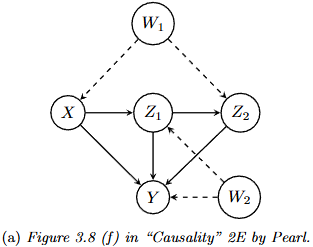

# documents

Jacob Colvin

resume and documents

- [Resume](<Jacob Colvin.pdf>)
- [Causal Inference Do Calculus Example](causal_inference_do_calculus_example.pdf)
    - Uses the causal graph (or DAG) from figure 3.8 (f) from "Causality" by Judea Pearl, 2nd edition.
    - This includes essentially a cheat sheet for "Do Calculus" with a worked-out example with an excessive amount of work shown documenting each step.
    - The purpose was to verify if your causal graph sticks with normal distributions and linear transformations (i.e. can use linear regression models).  Will the resulting causal model remain analytically tractable with no monte carlo simulation required?
    - Some of the math gets very messy due to the need to 'complete the square' three times, resulting in a nested fraction that is tedious to simplify.
    - For reference, this is the causal graph.
        - 1 input node, X
        - 2 internal nodes, Z
        - 2 unobservable nodes, W (possible confounder)
        - 1 output node, Y

    
